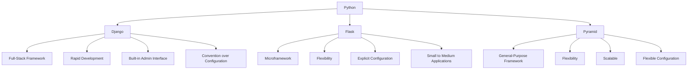

# Introduction to Web Development Using Python

## I. Introduction
### Importance of Web Development
In today's digital age, web development is crucial as it forms the backbone of our online experience. Websites and web applications are integral to businesses, education, communication, and entertainment. They provide platforms for e-commerce, information sharing, social networking, and more. As our reliance on the internet grows, the demand for skilled web developers continues to rise.

### Overview of the Tutorial
This tutorial will introduce you to the fundamental concepts of web development, focusing on tools and technologies using Python. We will cover:
- Basic web development concepts
- The difference between frontend and backend development
- Python’s role in web development
- Setting up your development environment
- Creating a simple web application
- Understanding HTTP and URLs
- Handling requests and responses
- Templating and rendering dynamic content
- Working with databases
- Deploying and hosting your web application
- Resources for further learning

## II. What is Web Development?

### Definition and Role

Web development is the process of building and maintaining websites and web applications that function over the internet or an intranet. This multifaceted discipline includes various aspects such as web design, web content development, client-side/server-side scripting, network security configuration, and more. Web development can range from creating simple static pages with plain text to complex web-based applications, electronic businesses, and social network services.

The primary goal of web development is to ensure that websites and applications are functional, user-friendly, and efficient. This involves a wide array of tasks, from conceptualizing and designing the layout and features of a website, to writing code that brings these concepts to life, and ensuring that the site runs smoothly and securely. 

Web developers must have a deep understanding of both the aesthetic and technical aspects of web design and must keep abreast of the latest industry trends and technologies. Their responsibilities can include:
- **Frontend Development:** Crafting the user interface and user experience using technologies such as HTML, CSS, and JavaScript.
- **Backend Development:** Building and maintaining the server, application, and database that enable the frontend to function.
- **Full-Stack Development:** Combining both frontend and backend development to handle all aspects of a website’s architecture.

Furthermore, web development is crucial for businesses of all sizes. For small businesses, a well-designed website can provide a cost-effective way to reach a larger audience, establish credibility, and compete with larger enterprises. For larger businesses, sophisticated web applications can streamline operations, enhance customer service, and create new revenue streams. In the modern digital landscape, having a strong web presence is essential for any organization looking to thrive.

### Client-Server Architecture

Web development relies heavily on a client-server architecture, which forms the fundamental structure of how data and applications are delivered over the internet. This architecture divides the tasks and workloads between two main entities: clients and servers.

#### Client

The client is typically the web browser (such as Google Chrome, Mozilla Firefox, Microsoft Edge, or Safari) that a user interacts with. The client sends requests to the server for web pages and other resources, and it renders these resources for the user to view and interact with. 

Clients are responsible for:
- **Rendering Content:** Displaying the HTML, CSS, and JavaScript received from the server to the user.
- **User Interaction:** Capturing user inputs (such as clicks, form submissions, etc.) and sending them to the server.
- **Local Storage:** Storing data locally to improve performance and provide offline capabilities.

The client-side of web development focuses on creating a seamless, engaging, and intuitive experience for users. It ensures that the website or application looks good, functions well, and responds quickly to user actions.

#### Server

The server is a powerful computer that stores the website’s data, applications, and databases. It responds to requests from the client by serving the appropriate content and handling any necessary processing. The server’s responsibilities include:
- **Data Storage:** Managing the databases that store website data, such as user accounts, product information, or blog posts.
- **Application Logic:** Executing server-side code that processes user requests, applies business logic, and generates the dynamic content that will be sent to the client.
- **Security:** Implementing measures to protect data and applications from unauthorized access and cyber threats.

When a client sends a request (for example, when a user navigates to a webpage), the server processes this request, retrieves the necessary data, and sends back the appropriate response (such as an HTML page, an image, or JSON data for a web application). This interaction is fundamental to the functioning of the web.

#### Interaction Between Client and Server

The interaction between the client and the server follows a standard protocol known as HTTP (Hypertext Transfer Protocol). Here’s a simplified breakdown of how this interaction typically works:
1. **Request:** The client sends an HTTP request to the server, asking for a specific resource (such as a webpage).
2. **Processing:** The server receives the request, processes it (which might involve querying a database or running some backend code), and prepares a response.
3. **Response:** The server sends an HTTP response back to the client, which includes the requested resource (such as HTML, CSS, JavaScript files, or data).
4. **Rendering:** The client receives the response and renders the content, displaying the webpage to the user.

This client-server model ensures that users can access and interact with websites and applications from anywhere in the world, as long as they have an internet connection. It also allows for the efficient use of resources, as the heavy lifting (data processing, storage, etc.) is handled by the server, while the client focuses on providing a smooth and responsive user experience.

In summary, web development is an essential field that encompasses the creation and maintenance of websites and web applications. It involves both frontend and backend development and relies on a client-server architecture to deliver content and functionality over the internet. This architecture ensures that websites are accessible, efficient, and secure, providing users with a seamless online experience.


## III. Frontend vs. Backend Development

### Frontend Development
Frontend development is all about creating the part of a website or web application that users directly interact with. This includes everything that users experience visually and can manipulate through their browsers. The goal is to create a seamless, intuitive, and engaging user experience.

#### Key Technologies

| Technology                         | Description                                                                                                 | Example Usage                                |
|------------------------------------|-------------------------------------------------------------------------------------------------------------|----------------------------------------------|
| **HTML (HyperText Markup Language)** | HTML is the standard markup language used to create and structure the content of web pages.                  | Creating the structure of a web page, such as headings, paragraphs, links, and images. |
| **CSS (Cascading Style Sheets)**    | CSS is used to control the presentation, formatting, and layout of the content on the web.                   | Styling elements, such as setting fonts, colors, spacing, and layout.               |
| **JavaScript**                     | JavaScript is a programming language that enables dynamic content and interactive elements on web pages.     | Creating interactive forms, animations, and dynamically updating content without reloading the page. |

#### Detailed Roles and Responsibilities

| Role               | Responsibilities                                                                                              |
|--------------------|--------------------------------------------------------------------------------------------------------------|
| **Web Designer**   | Focuses on the aesthetics of a website, including layout, color schemes, typography, and overall visual style. |
| **Frontend Developer** | Implements the web designer's vision using HTML, CSS, and JavaScript, ensuring responsiveness and accessibility. |
| **UX/UI Designer** | Enhances user experience by improving the usability, accessibility, and interaction of the website.            |

#### Tools and Frameworks

| Tool/Framework           | Description                                                                                                   | Example Usage                                 |
|--------------------------|---------------------------------------------------------------------------------------------------------------|----------------------------------------------|
| **Bootstrap**            | A popular CSS framework that helps in designing responsive and mobile-first websites.                         | Quickly creating layouts and styling web pages. |
| **React**                | A JavaScript library for building user interfaces, particularly single-page applications.                     | Creating dynamic and interactive components.  |
| **Vue.js**               | A progressive JavaScript framework for building user interfaces and single-page applications.                 | Developing interactive web applications with ease. |
| **Sass**                 | A preprocessor scripting language that is interpreted or compiled into CSS.                                   | Writing more maintainable and reusable CSS.   |

### Backend Development
Backend development is focused on the server side of a website or web application. It involves managing the server, database, and application logic that power the frontend. The backend is responsible for ensuring that everything works smoothly behind the scenes, processing user requests, and providing the necessary data and functionality.

#### Key Technologies

| Technology                         | Description                                                                                                 | Example Usage                                 |
|------------------------------------|-------------------------------------------------------------------------------------------------------------|----------------------------------------------|
| **Python**                         | Python is a versatile and powerful programming language known for its readability and efficiency.            | Writing server-side logic, processing data, and integrating with other services.    |
| **Frameworks**                     | Frameworks like Django, Flask, and Pyramid streamline backend development by providing tools and libraries.  | Building web applications, handling requests, and managing databases.               |
| **Databases**                      | Databases like PostgreSQL, MySQL, and SQLite are used to store, retrieve, and manage data.                   | Storing user information, content, and application data.                            |

#### Detailed Roles and Responsibilities

| Role                 | Responsibilities                                                                                             |
|----------------------|-------------------------------------------------------------------------------------------------------------|
| **Backend Developer** | Writes server-side code, manages databases, and ensures that the server, application, and database communicate properly. |
| **Database Administrator (DBA)** | Maintains the database systems, ensuring data integrity, performance, and security.                 |
| **DevOps Engineer**  | Manages the infrastructure and deployment processes, ensuring continuous integration and delivery.           |

#### Tools and Frameworks

| Tool/Framework            | Description                                                                                                   | Example Usage                                 |
|---------------------------|---------------------------------------------------------------------------------------------------------------|----------------------------------------------|
| **Django**                | A high-level Python web framework that encourages rapid development and clean, pragmatic design.               | Building robust and scalable web applications quickly. |
| **Flask**                 | A microframework for Python that's lightweight and easy to use, perfect for small to medium-sized applications.| Developing simple and flexible web applications. |
| **Pyramid**               | A flexible and modular framework for Python, suitable for both small and large applications.                   | Building applications with complex requirements and modular architecture. |
| **PostgreSQL**            | An open-source relational database management system known for its robustness and feature set.                | Managing complex data operations and transactions. |
| **MySQL**                 | A widely-used open-source relational database management system known for its reliability and performance.     | Storing and retrieving data for web applications. |
| **SQLite**                | A lightweight, file-based database management system that's easy to use and set up.                           | Embedding databases in standalone applications or for development and testing purposes. |

### Interaction Between Frontend and Backend
The interaction between frontend and backend development is crucial for the overall functionality and user experience of a web application. Here’s a breakdown of how these two areas collaborate:

| Aspect                      | Description                                                                                               |
|-----------------------------|-----------------------------------------------------------------------------------------------------------|
| **APIs (Application Programming Interfaces)** | APIs are used to facilitate communication between the frontend and backend. They define endpoints through which the frontend can send requests and the backend can respond with the necessary data. |
| **Data Flow**               | Data flows from the frontend to the backend when a user performs an action (e.g., submitting a form). The backend processes this data and returns the required information to the frontend, which then updates the user interface accordingly. |
| **Authentication and Authorization** | The backend manages user authentication and authorization, ensuring that users can only access resources and perform actions they are permitted to. The frontend handles the presentation of the login forms and error messages. |

By understanding the distinct roles and technologies of frontend and backend development, developers can collaborate more effectively to create seamless, efficient, and user-friendly web applications.
## IV. Introduction to Python for Web Development

### Python's Suitability

Python is renowned for its simplicity and readability, making it an excellent choice for web development. Its syntax is clear and concise, which allows developers to write less code compared to other languages. Python's extensive ecosystem of libraries and frameworks further enhances its capabilities, making the development process more efficient and manageable.

Python's Advantages for Web Development:
- **Readability:** Python's syntax is straightforward and easy to learn, reducing the learning curve for new developers.
- **Productivity:** Developers can write code faster, with fewer lines, and focus on solving problems rather than worrying about complex syntax.
- **Extensive Libraries:** Python offers a vast collection of libraries for various functionalities, from web development to data analysis.
- **Community Support:** Python has a large, active community that contributes to a wealth of resources, documentation, and third-party modules.
- **Versatility:** Python is versatile and can be used for various types of applications, including web development, data science, machine learning, and more.

### Popular Python Web Frameworks

Python's popularity in web development is largely due to its powerful frameworks. These frameworks provide the necessary tools and structures for building robust web applications efficiently. Let's explore some of the most popular Python web frameworks in detail.

#### Comparison of Popular Python Web Frameworks

| Feature              | Django                              | Flask                              | Pyramid                            |
|----------------------|-------------------------------------|------------------------------------|------------------------------------|
| **Type**             | Full-Stack Framework                | Microframework                     | General-Purpose Framework          |
| **Target Use Case**  | Large-scale applications            | Small to medium applications       | Both small and large applications  |
| **Learning Curve**   | Moderate to Steep                   | Gentle                             | Moderate                           |
| **Configuration**    | Convention over Configuration       | Explicit Configuration             | Flexible Configuration             |
| **Admin Interface**  | Built-in Admin Interface            | No Built-in Admin Interface        | Optional Admin Interface           |
| **Database Support** | Built-in ORM (Object-Relational Mapping) | No Built-in ORM (use SQLAlchemy, etc.) | Extensible (use SQLAlchemy, etc.) |
| **Template Engine**  | Built-in (Django Template Language) | Jinja2                             | Chameleon, Jinja2, Mako            |
| **Routing**          | URL Dispatcher                       | Werkzeug Routing                   | URL Dispatching                    |
| **Security Features**| High (built-in security features)   | Medium (requires extensions)       | Medium (requires extensions)       |
| **Scalability**      | High                                | Medium                             | High                               |
| **Community Support**| Extensive                           | Large                              | Moderate                           |
| **Documentation**    | Extensive and Comprehensive         | Good                               | Detailed                           |

#### Diagram: Python Web Framework Ecosystem



#### In-Depth Overview of Each Framework

**Django:**
- **Overview:** Django is a high-level, full-stack web framework that encourages rapid development and a clean, pragmatic design. It follows the "batteries-included" philosophy, providing a comprehensive set of features out of the box.
- **Key Features:**
  - Built-in admin interface for managing application data.
  - ORM for database interactions, reducing the need for SQL.
  - Strong security features, including protection against SQL injection, cross-site scripting (XSS), and cross-site request forgery (CSRF).
  - Template engine for rendering dynamic HTML content.
  - Scalable architecture suitable for large applications.
- **Use Case:** Ideal for developing complex, data-driven websites and applications that require rapid development and robust features.

**Flask:**
- **Overview:** Flask is a lightweight microframework designed for flexibility and ease of use. It provides the essentials for web development, allowing developers to add additional functionalities as needed through extensions.
- **Key Features:**
  - Minimalistic core with a focus on simplicity.
  - Uses Jinja2 as its template engine for rendering HTML.
  - Extensible through a variety of third-party extensions (e.g., Flask-SQLAlchemy for database interactions, Flask-WTF for form handling).
  - Explicit configuration, giving developers control over components.
  - Suitable for small to medium applications or microservices.
- **Use Case:** Best for small to medium web applications, prototyping, or projects where the developer needs maximum control over the components used.

**Pyramid:**
- **Overview:** Pyramid is a general-purpose web framework designed to scale with your application. It’s highly flexible and can be used for both small and large applications.
- **Key Features:**
  - Flexible configuration options, allowing developers to choose components based on their needs.
  - Supports multiple template engines like Jinja2, Mako, and Chameleon.
  - Uses URL dispatch for routing, making it highly adaptable.
  - Extensible with various libraries for database interaction, security, and more.
  - Emphasizes flexibility and scalability.
- **Use Case:** Suitable for developers who need a framework that can handle projects of any size, offering flexibility to choose and configure components as required.

## V. Setting Up Your Development Environment

### Installing Python and a Web Framework

Setting up your development environment is the first step toward creating web applications with Python. This involves installing Python, selecting a web framework, and setting up a virtual environment to manage your project dependencies effectively. Below is a detailed guide on how to get started.

#### Step 1: Download and Install Python

First, you'll need to install Python on your machine. Python is available for multiple operating systems including Windows, macOS, and Linux.

1. **Download Python:**
   - Go to the official Python website: [python.org](https://www.python.org/).
   - Navigate to the Downloads section.
   - Choose the appropriate version for your operating system and download the installer.

2. **Install Python:**
   - Run the downloaded installer.
   - Ensure you check the box that says "Add Python to PATH" (important for command-line use).
   - Follow the installation prompts.


#### Step 2: Choose and Install a Web Framework

A web framework provides the tools and libraries necessary to build web applications efficiently. Django is a popular choice for its robustness and features.

1. **Install Django using pip:**
   - Open your command line or terminal.
   - Run the following command to install Django:
     ```bash
     pip install django
     ```

| Step      | Description                                                   |
|-----------|---------------------------------------------------------------|
| 1         | Open command line or terminal.                                |
| 2         | Type `pip install django` and press Enter.                    |
| 3         | Wait for the installation process to complete.                |
| 4         | Verify installation by typing `django-admin --version`.       |

### Setting Up Virtual Environments

Virtual environments are crucial for managing dependencies and ensuring that your projects are isolated from one another. This prevents conflicts between packages required by different projects.

#### Why Use Virtual Environments?

- **Dependency Management:** Each project can have its own dependencies, avoiding conflicts.
- **Isolation:** Ensures that changes in one project do not affect others.
- **Environment Control:** Allows you to use different Python versions for different projects.

#### Creating and Activating a Virtual Environment

1. **Create a Virtual Environment:**
   - Navigate to your project directory:
     ```bash
     cd path/to/your/project
     ```
   - Create a virtual environment named `myenv`:
     ```bash
     python -m venv myenv
     ```

2. **Activate the Virtual Environment:**

   - **On Windows:**
     ```bash
     myenv\Scripts\activate
     ```
   - **On macOS/Linux:**
     ```bash
     source myenv/bin/activate
     ```

| Step      | Windows Command                       | macOS/Linux Command               |
|-----------|---------------------------------------|-----------------------------------|
| Navigate  | `cd path\to\your\project`             | `cd path/to/your/project`         |
| Create    | `python -m venv myenv`                | `python -m venv myenv`            |
| Activate  | `myenv\Scripts\activate`              | `source myenv/bin/activate`       |
| Deactivate| `deactivate`                          | `deactivate`                      |


#### Verifying Your Environment

To ensure that your virtual environment is set up correctly, you can check the installed packages and Python version:

1. **Check Python Version:**
   ```bash
   python --version
   ```
2. **List Installed Packages:**
   ```bash
   pip list
   ```

This will show that your Python environment is isolated, and only the packages you explicitly install in this environment will be available.

### Example Workflow

To illustrate the setup process, here's an example workflow:

1. **Navigate to your project directory:**
   ```bash
   cd path/to/your/project
   ```

2. **Create a virtual environment:**
   ```bash
   python -m venv myenv
   ```

3. **Activate the virtual environment:**
   ```bash
   source myenv/bin/activate  # On Windows: myenv\Scripts\activate
   ```

4. **Install Django:**
   ```bash
   pip install django
   ```

5. **Start a new Django project:**
   ```bash
   django-admin startproject myproject
   ```

6. **Navigate to the project directory and run the server:**
   ```bash
   cd myproject
   python manage.py runserver
   ```

By following these steps, you’ll have a fully functional Django development environment, isolated and ready for you to start building your web application.

## VI. Creating Your First Web Application

### Step-by-Step Guide

Creating your first web application using Django involves several steps. Below, we outline each step in detail, supplemented with tables and diagrams to help visualize the process.

#### 1. Start a New Project

Begin by setting up a new Django project. Open your terminal and run the following commands:

```bash
django-admin startproject myproject
cd myproject
```

This command creates a new directory called `myproject` with the following structure:

```
myproject/
├── manage.py
└── myproject/
    ├── __init__.py
    ├── asgi.py
    ├── settings.py
    ├── urls.py
    └── wsgi.py
```

- **manage.py:** A command-line utility to interact with the project.
- **myproject/__init__.py:** An empty file that indicates this directory is a Python package.
- **myproject/asgi.py:** Configuration for ASGI (Asynchronous Server Gateway Interface).
- **myproject/settings.py:** The project’s settings/configuration file.
- **myproject/urls.py:** The URL declarations for this Django project.
- **myproject/wsgi.py:** Configuration for WSGI (Web Server Gateway Interface).

**Diagram: Project Structure**

```plaintext
myproject/
├── manage.py
└── myproject/
    ├── __init__.py
    ├── asgi.py
    ├── settings.py
    ├── urls.py
    └── wsgi.py
```

#### 2. Run the Server

Next, start the development server to ensure everything is set up correctly:

```bash
python manage.py runserver
```

You should see output similar to this:

```plaintext
Watching for file changes with StatReloader
Performing system checks...

System check identified no issues (0 silenced).
June 07, 2024 - 12:34:56
Django version 4.x, using settings 'myproject.settings'
Starting development server at http://127.0.0.1:8000/
Quit the server with CONTROL-C.
```

Visit `http://127.0.0.1:8000/` in your web browser. You should see the default Django welcome page.

#### 3. Create an App

In Django, an app is a web application that does something — for example, a blog, a database of records, or a simple poll. To create an app, run:

```bash
python manage.py startapp myapp
```

This creates a new directory `myapp` with the following structure:

```
myapp/
├── __init__.py
├── admin.py
├── apps.py
├── migrations/
│   └── __init__.py
├── models.py
├── tests.py
└── views.py
```

- **admin.py:** Configuration for the Django admin interface.
- **apps.py:** Configuration for the app itself.
- **migrations/**: Directory for database migrations.
- **models.py:** Data models for the app.
- **tests.py:** Tests for the app.
- **views.py:** Views for the app.

**Diagram: App Structure**

```plaintext
myapp/
├── __init__.py
├── admin.py
├── apps.py
├── migrations/
│   └── __init__.py
├── models.py
├── tests.py
└── views.py
```

### Basic Structure

#### Routes

Routes in Django are defined in `urls.py` files. The main `urls.py` file is located in the project directory and includes URLs for the whole project. Apps can have their own `urls.py` files.

**Example: Project `urls.py`**

```python
from django.contrib import admin
from django.urls import path, include

urlpatterns = [
    path('admin/', admin.site.urls),
    path('', include('myapp.urls')),
]
```

**Example: App `urls.py`**

Create a `urls.py` file inside the `myapp` directory:

```python
from django.urls import path
from . import views

urlpatterns = [
    path('', views.home, name='home'),
]
```

**Diagram: URL Routing**

```plaintext
Client Request
       |
       v
myproject/urls.py -> myapp/urls.py -> views.home
```

#### Views

Views handle requests and return responses. Create a simple view in `myapp/views.py`:

**Example: `views.py`**

```python
from django.http import HttpResponse

def home(request):
    return HttpResponse("Hello, World!")
```

#### Templates

Templates render HTML with dynamic data. Create a `templates` directory inside `myapp` and add an `index.html` file:

**Directory Structure**

```
myapp/
├── templates/
│   └── index.html
```

**Example: `index.html`**

```html
<!DOCTYPE html>
<html>
<head>
    <title>My First Django App</title>
</head>
<body>
    <h1>{{ message }}</h1>
</body>
</html>
```

Modify the `home` view to use this template:

**Example: `views.py`**

```python
from django.shortcuts import render

def home(request):
    context = {'message': 'Hello, World!'}
    return render(request, 'index.html', context)
```

**Diagram: View-Template Interaction**

```plaintext
views.home
    |
    v
render('index.html', context)
    |
    v
index.html
    |
    v
HTML Response
```

By following these steps, you create a basic Django web application with a simple homepage. This structure can be expanded with more views, templates, and routes as you build more complex applications.

## VII. Understanding HTTP and URLs

### HTTP Protocol

#### Overview of HTTP

HTTP (HyperText Transfer Protocol) is the foundation of data communication on the web. It is an application-layer protocol used for transmitting hypermedia documents, such as HTML. HTTP is designed to enable communications between clients and servers. It is a request-response protocol, where the client (usually a web browser) makes a request, and the server (which hosts the website or web application) returns a response.

Here is a more detailed look at the key components and concepts of HTTP:

| **Component**      | **Description**                                                                                   |
|--------------------|---------------------------------------------------------------------------------------------------|
| **Request**        | Sent by the client to the server, requesting a resource or action.                                |
| **Response**       | Sent by the server to the client, providing the requested resource or the outcome of the request. |
| **Methods**        | Defines the action to be performed on the resource (GET, POST, PUT, DELETE, etc.).                |
| **Status Codes**   | Indicates the result of the request (200 OK, 404 Not Found, 500 Internal Server Error, etc.).     |
| **Headers**        | Metadata accompanying the request and response (Content-Type, User-Agent, Accept, etc.).          |
| **Body**           | The actual data being transmitted (HTML content, JSON data, file, etc.).                          |

#### HTTP Request Structure

An HTTP request consists of several parts, which are illustrated in the table below:

| **Part**             | **Description**                                                                                   | **Example**                        |
|----------------------|---------------------------------------------------------------------------------------------------|------------------------------------|
| **Request Line**     | Specifies the method, URL, and HTTP version.                                                      | `GET /index.html HTTP/1.1`         |
| **Headers**          | Provides additional information about the request or the client.                                  | `Host: www.example.com`            |
| **Blank Line**       | Separates headers from the body.                                                                  | (Empty line)                       |
| **Body**             | Contains data to be sent to the server (optional, typically in POST requests).                    | `username=user&password=pass`      |

#### HTTP Response Structure

An HTTP response follows a similar structure:

| **Part**             | **Description**                                                                                   | **Example**                        |
|----------------------|---------------------------------------------------------------------------------------------------|------------------------------------|
| **Status Line**      | Indicates the HTTP version, status code, and reason phrase.                                       | `HTTP/1.1 200 OK`                  |
| **Headers**          | Provides additional information about the server or the response.                                 | `Content-Type: text/html`          |
| **Blank Line**       | Separates headers from the body.                                                                  | (Empty line)                       |
| **Body**             | Contains the actual resource (HTML content, JSON data, file, etc.).                               | `<!DOCTYPE html><html>...</html>`  |

### URLs (Uniform Resource Locators)

A URL (Uniform Resource Locator) is the address used to access resources on the web. It is composed of several components, each serving a specific purpose. Understanding these components is crucial for navigating and structuring web resources.

#### Components of a URL

| **Component**    | **Description**                                                                                                   | **Example**                  |
|------------------|-------------------------------------------------------------------------------------------------------------------|------------------------------|
| **Scheme**       | Specifies the protocol used to access the resource.                                                              | `http`, `https`              |
| **Host**         | Indicates the domain name or IP address of the server where the resource is hosted.                              | `www.example.com`            |
| **Port**         | (Optional) Specifies the port number on the server to connect to. Default is 80 for HTTP and 443 for HTTPS.      | `:80`, `:443`                |
| **Path**         | Specifies the exact resource or file within the host that the client wants to access.                            | `/about`, `/images/logo.png` |
| **Query**        | (Optional) Provides additional parameters for the resource, typically used in search or filtering.               | `?id=123&sort=asc`           |
| **Fragment**     | (Optional) Refers to a specific part of the resource, usually within a webpage.                                   | `#section2`, `#top`          |

#### Example Breakdown of a URL

Consider the following URL: `https://www.example.com:8080/path/to/resource?query=value#fragment`

| **Component**    | **Value**                 | **Description**                                                                                     |
|------------------|---------------------------|-----------------------------------------------------------------------------------------------------|
| **Scheme**       | `https`                   | Protocol indicating a secure HTTP connection.                                                      |
| **Host**         | `www.example.com`         | Domain name of the server hosting the resource.                                                     |
| **Port**         | `8080`                    | Port number specifying a non-default port for the HTTPS connection.                                 |
| **Path**         | `/path/to/resource`       | Path specifying the location of the resource within the server.                                     |
| **Query**        | `query=value`             | Query string providing additional parameters for accessing the resource.                            |
| **Fragment**     | `#fragment`               | Fragment identifier pointing to a specific section within the resource.                             |

### Visual Representation of a URL

Below is a visual diagram representing the components of a URL:

```
https://www.example.com:8080/path/to/resource?query=value#fragment
\_____/  \__________/ \__/ \____________________/ \__________/ \_______/
  |         |           |           |                  |          |
Scheme     Host        Port        Path              Query     Fragment
```

#### HTTP Methods and Status Codes

HTTP methods indicate the desired action to be performed on the identified resource. Here is a table summarizing common HTTP methods and their typical uses:

| **Method** | **Description**                                                                                           | **Example**                                      |
|------------|-----------------------------------------------------------------------------------------------------------|--------------------------------------------------|
| **GET**    | Requests a representation of the specified resource. Used to retrieve data.                               | `GET /index.html`                                |
| **POST**   | Submits data to be processed to a specified resource. Often causes a change in state or side effects.     | `POST /form-submit`                              |
| **PUT**    | Replaces all current representations of the target resource with the uploaded content.                    | `PUT /user/123`                                  |
| **DELETE** | Deletes the specified resource.                                                                           | `DELETE /user/123`                               |
| **PATCH**  | Applies partial modifications to a resource.                                                              | `PATCH /user/123`                                |
| **HEAD**   | Same as GET, but transfers the status line and header section only.                                       | `HEAD /index.html`                               |

HTTP status codes are issued by the server in response to a client’s request. They are grouped into five classes:

| **Status Code Class** | **Range**  | **Description**                                  | **Examples**                                         |
|-----------------------|------------|--------------------------------------------------|------------------------------------------------------|
| **1xx Informational** | 100-199    | Request received, continuing process.            | 100 Continue, 101 Switching Protocols                |
| **2xx Success**       | 200-299    | Request was successfully received, understood, and accepted. | 200 OK, 201 Created, 204 No Content                  |
| **3xx Redirection**   | 300-399    | Further action needs to be taken in order to complete the request. | 301 Moved Permanently, 302 Found, 304 Not Modified   |
| **4xx Client Error**  | 400-499    | The request contains bad syntax or cannot be fulfilled. | 400 Bad Request, 401 Unauthorized, 404 Not Found     |
| **5xx Server Error**  | 500-599    | The server failed to fulfill an apparently valid request. | 500 Internal Server Error, 502 Bad Gateway, 503 Service Unavailable |

### Visual Representation of HTTP Request/Response Cycle

Below is a simplified diagram representing the HTTP request/response cycle:

```
Client                              Server
  |                                   |
  |  1. Send HTTP Request             |
  |---------------------------------->|
  |                                   |
  |  2. Process Request               |
  |                                   |
  |  3. Send HTTP Response            |
  |<----------------------------------|
  |                                   |
  |  4. Render Response               |
```

1. **Client sends an HTTP request:** This includes the request line, headers, and possibly a body (for POST requests).
2. **Server processes the request:** The server interprets the request, performs the necessary actions (e.g., querying a database), and prepares a response.
3. **Server sends an HTTP response:** This includes the status line, headers, and possibly a body (containing the requested resource or data).
4. **Client renders the response:** The client browser renders the response, displaying the web page or data to the user.

By understanding HTTP and URLs, web developers can effectively structure, access, and manipulate web resources, ensuring efficient and reliable communication between clients and servers. This foundational knowledge is crucial for building robust web applications and services.
## VIII. Handling Requests and Responses

### HTTP Requests and Methods

When a client wants to communicate with a server, it sends an HTTP request. The server processes this request and returns an appropriate HTTP response. Understanding the various HTTP methods and how to handle these requests is fundamental in web development.

#### Overview of HTTP Methods

HTTP methods define the type of operation to be performed on a resource. The most commonly used methods are:

| **HTTP Method** | **Description**                                         | **Use Case**                                                |
|-----------------|---------------------------------------------------------|-------------------------------------------------------------|
| **GET**         | Requests data from a specified resource.                | Retrieving data (e.g., loading a webpage, fetching API data)|
| **POST**        | Submits data to be processed to a specified resource.   | Submitting form data, uploading a file                      |
| **PUT**         | Updates a current resource with new data.               | Updating user information                                   |
| **DELETE**      | Deletes a specified resource.                           | Removing a record from a database                           |
| **PATCH**       | Partially updates a resource.                           | Updating a specific field in a record                       |
| **HEAD**        | Similar to GET but only retrieves headers.              | Checking if a resource exists                               |

#### Detailed Look at GET and POST Methods

- **GET Method:**
  - **Purpose:** Retrieve data from the server.
  - **Characteristics:** 
    - Can be cached.
    - Remains in browser history.
    - Can be bookmarked.
    - Parameters are appended to the URL.
  - **Example Usage:** Accessing a webpage.
  - **Example Request:**
    ```
    GET /index.html HTTP/1.1
    Host: www.example.com
    ```

- **POST Method:**
  - **Purpose:** Send data to the server to be processed.
  - **Characteristics:**
    - Not cached.
    - Does not remain in browser history.
    - Cannot be bookmarked.
    - Parameters are included in the body of the request.
  - **Example Usage:** Submitting a contact form.
  - **Example Request:**
    ```
    POST /submit-form HTTP/1.1
    Host: www.example.com
    Content-Type: application/x-www-form-urlencoded

    name=John&email=john@example.com
    ```

### HTTP Status Codes

HTTP status codes are standardized responses that indicate the result of the client’s request. They help diagnose issues and understand how the server handled the request.

| **Status Code** | **Description**                                   | **Example Scenario**                         |
|-----------------|---------------------------------------------------|----------------------------------------------|
| **200 OK**      | The request was successful and the server returned the requested resource. | A webpage loaded successfully.               |
| **201 Created** | The request was successful and a new resource was created. | A new user account was created.              |
| **204 No Content** | The server successfully processed the request, but is not returning any content. | A record was successfully deleted.           |
| **400 Bad Request** | The server could not understand the request due to invalid syntax. | A malformed request due to invalid parameters.|
| **401 Unauthorized** | Authentication is required and has failed or has not been provided. | Accessing a restricted resource without a token.|
| **403 Forbidden** | The client does not have access rights to the content. | Trying to access an admin page as a regular user.|
| **404 Not Found** | The server could not find the requested resource. | A user trying to access a non-existent page.  |
| **500 Internal Server Error** | The server encountered an unexpected condition. | A bug in the server-side code caused an error.|
| **502 Bad Gateway** | The server received an invalid response from an upstream server. | A reverse proxy received a bad response.     |
| **503 Service Unavailable** | The server is currently unavailable (overloaded or down for maintenance). | The server is undergoing maintenance.        |

### Handling in Python

In web development with Python, frameworks like Django handle HTTP requests and responses efficiently. Views in Django are Python functions or classes that take a web request and return a web response. Here’s how you can handle a simple request and generate a response in Django:

#### Example of a Simple View in Django

To handle HTTP requests and generate responses in Django, you define views. Below is an example of a basic view function that handles a GET request and returns a "Hello, World!" response.

1. **Create a Django Project and Application:**
   ```bash
   django-admin startproject myproject
   cd myproject
   python manage.py startapp myapp
   ```

2. **Define a View in `myapp/views.py`:**
   ```python
   from django.http import HttpResponse

   def hello_world(request):
       return HttpResponse("Hello, World!")
   ```

3. **Configure URL Routing in `myproject/urls.py`:**
   ```python
   from django.contrib import admin
   from django.urls import path
   from myapp.views import hello_world

   urlpatterns = [
       path('admin/', admin.site.urls),
       path('hello/', hello_world),
   ]
   ```

4. **Run the Development Server:**
   ```bash
   python manage.py runserver
   ```

5. **Access the View in a Web Browser:**
   Open your web browser and navigate to `http://127.0.0.1:8000/hello/`. You should see "Hello, World!" displayed.

#### Detailed Breakdown of the View Handling Process

| **Step**        | **Description**                                                                                       | **Code Example**                              |
|-----------------|-------------------------------------------------------------------------------------------------------|----------------------------------------------|
| **Define View** | Create a view function that takes a request object and returns a response object.                     | `def hello_world(request): return HttpResponse("Hello, World!")` |
| **URL Routing** | Map the URL pattern to the view function in the `urls.py` file.                                        | `path('hello/', hello_world),`               |
| **Run Server**  | Start the Django development server to listen for incoming requests.                                   | `python manage.py runserver`                 |
| **Access View** | Use a web browser to send a GET request to the URL mapped to the view function.                        | Navigate to `http://127.0.0.1:8000/hello/`   |
| **Response**    | The server processes the request and sends back the "Hello, World!" response to the client.            | The client displays "Hello, World!"          |

By following these steps, you can handle HTTP requests and responses effectively in a Django web application. This foundational knowledge is essential for building more complex web applications that interact with users, process data, and provide dynamic content.## IX. Templating and Rendering

### Templating Engines

Templating engines play a crucial role in web development by allowing developers to generate dynamic HTML content. These engines enable the separation of presentation and logic, making it easier to manage and maintain code. In the context of Python web development, Django comes with its own powerful template engine.

#### What is a Templating Engine?

A templating engine is a tool that processes template files, replacing variables and expressions with actual values to generate output HTML. Templates typically contain placeholders or tags that are dynamically replaced with data from the server before being sent to the client.

In Django's template engine, the most commonly used syntax for placeholders is double curly braces (`{{ variable }}`), as shown in the example below:

```html
<!-- template.html -->
<h1>Hello, {{ name }}!</h1>
```

In this example, `{{ name }}` is a placeholder that will be replaced with the value of the `name` variable when the template is rendered.

### Rendering Templates in Django

In Django, views are responsible for handling HTTP requests and generating responses. Views can render templates by passing data to them using a context dictionary. Here's how you can render the above template with a dynamic `name` variable in Django:

```python
from django.shortcuts import render

def hello_name(request, name):
    return render(request, 'template.html', {'name': name})
```

In this code snippet:
- `hello_name` is a view function that takes a request object and a `name` parameter.
- The `render` function is used to render the `template.html` template with the provided context data (`{'name': name}`).
- The `name` variable is dynamically passed to the template and will be substituted into the placeholder (`{{ name }}`).

When a user accesses the corresponding URL (e.g., `/hello/John`), Django will render the `template.html` template with the provided `name` variable, resulting in an HTML page that greets the user with "Hello, John!".

### Advantages of Using Templating Engines

Using a templating engine like Django's offers several benefits:

1. **Separation of Concerns:** Templating engines enable a clean separation of presentation logic from business logic, making code easier to understand and maintain.

2. **Code Reusability:** Templates allow developers to reuse common HTML structures and components across multiple pages, reducing code duplication.

3. **Dynamic Content Generation:** Templating engines make it easy to generate dynamic content by inserting data into templates at runtime.

4. **Extensibility:** Django's template engine provides powerful features such as template inheritance, custom template tags, and filters, allowing developers to create complex and flexible templates.

By leveraging templating engines, developers can create dynamic, responsive, and maintainable web applications with ease. They provide a robust foundation for building user-friendly interfaces and delivering dynamic content to users.
## X. Working with Databases

### Role of Databases

Databases play a critical role in web development by providing a structured and efficient way to store and retrieve application data. They serve as a persistent storage solution for web applications, allowing data to be stored securely and accessed quickly when needed. Databases are essential for dynamic web applications that require the storage and manipulation of large volumes of data.

### Interacting with Databases

In Python web development, frameworks like Django provide built-in support for interacting with databases using Object-Relational Mapping (ORM). ORM is a programming technique that maps objects in code to tables in a relational database, making it easier to perform database operations using familiar Python syntax.

#### What is ORM?

Object-Relational Mapping (ORM) is a programming technique that allows developers to interact with relational databases using object-oriented programming concepts. With ORM, database tables are represented as classes, and rows in the tables are represented as instances of these classes. This abstraction layer simplifies database interactions and reduces the need for writing raw SQL queries.

#### Example of ORM in Django

In Django, models are Python classes that represent database tables. Each model class corresponds to a table in the database, and each attribute of the class represents a column in the table. Here's an example of defining a simple model in Django:

```python
from django.db import models

class Person(models.Model):
    name = models.CharField(max_length=100)
    age = models.IntegerField()
```

In this example:
- The `Person` class is a Django model representing a database table named `person`.
- The `name` attribute represents a column in the `person` table with a maximum length of 100 characters.
- The `age` attribute represents a column in the `person` table storing integer values.

### Key Features of ORM

Using ORM in Python web development offers several advantages:

1. **Abstraction:** ORM abstracts away the complexities of database interactions, allowing developers to focus on application logic rather than database management.

2. **Portability:** ORM makes it easier to switch between different database systems (such as MySQL, PostgreSQL, SQLite) without changing application code.

3. **Security:** ORM helps prevent SQL injection attacks by automatically sanitizing input data and generating safe SQL queries.

4. **Flexibility:** ORM provides powerful querying capabilities, allowing developers to perform complex database operations using high-level Python syntax.

5. **Code Organization:** ORM promotes clean and modular code by encapsulating database-related logic within model classes.

By leveraging ORM, developers can build robust and scalable web applications with efficient database interactions. ORM simplifies database management tasks and accelerates the development process, enabling developers to focus on building great user experiences.

## XI. Deployment and Hosting

### Deployment Process

Deploying a web application involves making it accessible to users over the internet. Here's a general overview of the deployment process:

1. **Prepare Your Code:** Ensure that your codebase is well-organized and all dependencies are listed in a `requirements.txt` file. This file should include all libraries and packages required to run your application.

2. **Choose a Hosting Platform:** Select a hosting platform that best suits your application's needs. Popular options include Heroku, AWS (Amazon Web Services), DigitalOcean, and Google Cloud Platform. Consider factors such as scalability, pricing, and ease of use when choosing a platform.

3. **Configure the Server:** Set up your hosting environment by configuring the web server and application server. Typically, this involves installing and configuring software such as Nginx (web server) and Gunicorn (application server) to serve your web application.

### Web Hosting Services

There are several web hosting services available, each offering different features and pricing plans. Here are a few popular options:

#### Heroku

Heroku is a cloud platform that simplifies the deployment process, especially for small to medium-sized applications. It supports various programming languages and frameworks, including Python and Django. Heroku offers a free tier with limited resources, making it an excellent choice for getting started with deployment.

#### AWS (Amazon Web Services)

AWS is a comprehensive cloud computing platform that offers a wide range of services, including web hosting. It provides scalable and flexible hosting solutions suitable for both small and large applications. AWS offers services such as Amazon EC2 (Elastic Compute Cloud) for virtual servers, Amazon RDS (Relational Database Service) for managed databases, and Amazon S3 (Simple Storage Service) for file storage.

#### DigitalOcean

DigitalOcean is a cloud infrastructure provider known for its simplicity and affordability. It offers virtual servers known as "droplets" that can be quickly deployed and scaled according to your needs. DigitalOcean provides a user-friendly interface and straightforward pricing plans, making it an excellent choice for developers looking for a hassle-free hosting solution.

### Choosing the Right Hosting Service

When selecting a hosting service for your web application, consider factors such as scalability, reliability, performance, security, and cost. Evaluate each option based on your application's specific requirements and budget constraints. Additionally, consider the level of support and documentation provided by the hosting provider to ensure a smooth deployment process and ongoing maintenance of your application.

## XII. Next Steps and Resources

### Further Learning

Now that you have a solid understanding of the basics of web development with Python, here are some next steps to consider:

- **Explore Advanced Topics:** Delve into advanced topics such as RESTful APIs, authentication and authorization, web security, and frontend frameworks like React or Vue.js. These topics will enhance your skills and allow you to build more complex and feature-rich web applications.

- **Practice by Building Real Projects:** Put your knowledge into practice by working on real-world projects. Start with small projects and gradually increase their complexity as you gain confidence. Building projects will help reinforce your understanding of concepts and provide valuable hands-on experience.

### Resources

Here are some resources to help you continue your learning journey:

- [Django Documentation](https://docs.djangoproject.com/): The official documentation for Django, providing comprehensive guides, tutorials, and references for building web applications with Django.

- [Flask Documentation](https://flask.palletsprojects.com/): The official documentation for Flask, offering detailed documentation and tutorials for developing web applications using the Flask framework.

- [Python Web Development Tutorials](https://realpython.com/): Real Python offers a variety of tutorials and articles covering various aspects of Python web development, from basics to advanced topics.

## XIII. Conclusion

### Summary

In this tutorial, we covered the essentials of web development with Python. We discussed frontend and backend development, setting up a development environment, creating a basic web application, understanding HTTP, templating, working with databases, and deploying your application.
